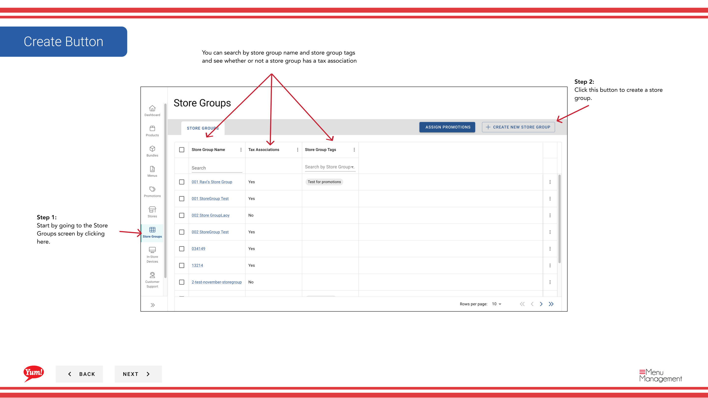

# Create a Store Group

## What this guide covers

Creates a named grouping of stores that share menu, promotion, or tax configurations — a foundational structure for managing multiple locations at scale.

## Steps

**Step 1:** Start by going to the Store Groups screen by clicking here.
**Step 2:** Click this button to create a store group.

**Step 3:** Type in the store group name for the store you want to create and enter any store group tags if needed.

**Step 4:** Toggle this switch to select a store

**Step 4:** Press this create button when finished with each step to finally create your store group.

## Notes

:::note
You can filter by stores and by store groups
:::

:::note
This table allows you to filter by store number, store name, and franchise code to find specific stores.
:::

:::note
This is a review of all the stores that were added
:::

:::note
This is a review of all the actions you’ve done in each step: Store group name/tag, and store selection.
:::

## Additional information

- Menu Management User Guide
- Store Groups - Create a Store Group
- You can search by store group name and store group tags and see whether or not a store group has a tax association

---

*Part of the [Admin Portal Guide](/docs/admin-portal-guide) · Section: Store Groups*