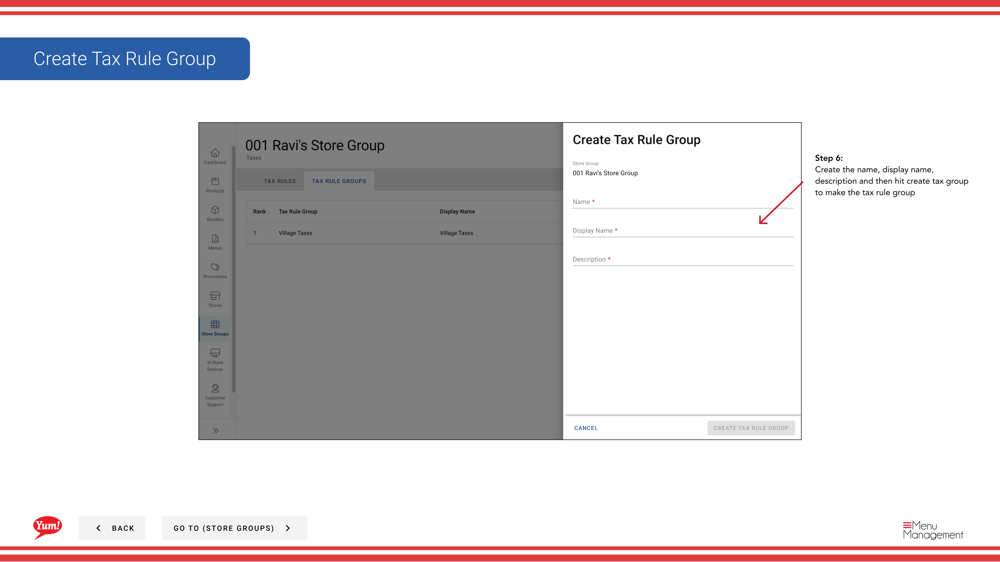

# Create Tax Rule Group

## What this guide covers

Creates a named tax rule group that bundles multiple related tax rules together, allowing you to organize and reuse tax configurations across store groups.

## Steps

**Step 1:** Navigate to the **Store Groups** section using the left-hand navigation menu.

**Step 2:** Find the store group where you want to create a tax rule group. Click the **action menu button** (three dots) next to the store group name.

**Step 3:** Click **Taxes** from the dropdown menu.

**Step 4:** Click the **Tax Rule Groups** tab.

**Step 5:** Click the **+ Create New Tax Rule Group** button.

**Step 6:** Fill in the tax rule group details. Fields marked with * are required.

| Field | What to enter | Notes |
|-------|--------------|-------|
| **Tax Rule Group Name** * | Descriptive name for this group | e.g., "Standard GST Group", "NSW Reduced Tax Rules". Should indicate what taxes are included. |
| **Display Name** * | Name shown in the interface | Usually same or similar to the Tax Rule Group Name. |
| **Description** | Optional explanation of the group's purpose | e.g., "GST rules applicable to New South Wales locations". |

**Step 7:** Click the **Create Tax Group** button to save the tax rule group.

:::note
Once created, a tax rule group is independent and can be used across multiple store groups. You can edit, copy, and delete tax rule groups at any time from this screen.
:::

:::tip
After creating a tax rule group, you'll need to add individual tax rules to it. See [Create Tax Rules](/docs/admin-portal-guide/store-groups/create-tax-rules/) for that step.
:::

## Related guides

- [Create Tax Rules](/docs/admin-portal-guide/store-groups/create-tax-rules/)
- [Edit a Store Group](/docs/admin-portal-guide/store-groups/edit-a-store-group/)

---

*Part of the [Admin Portal Guide](/docs/admin-portal-guide) · Section: Store Groups*