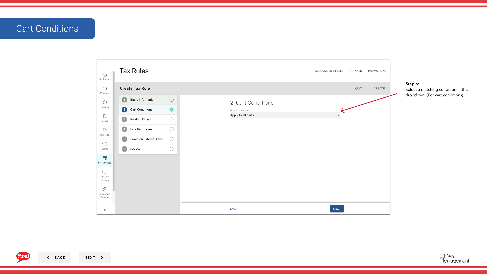
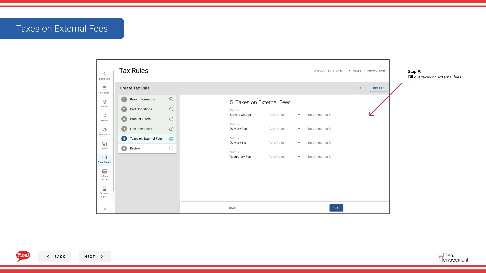
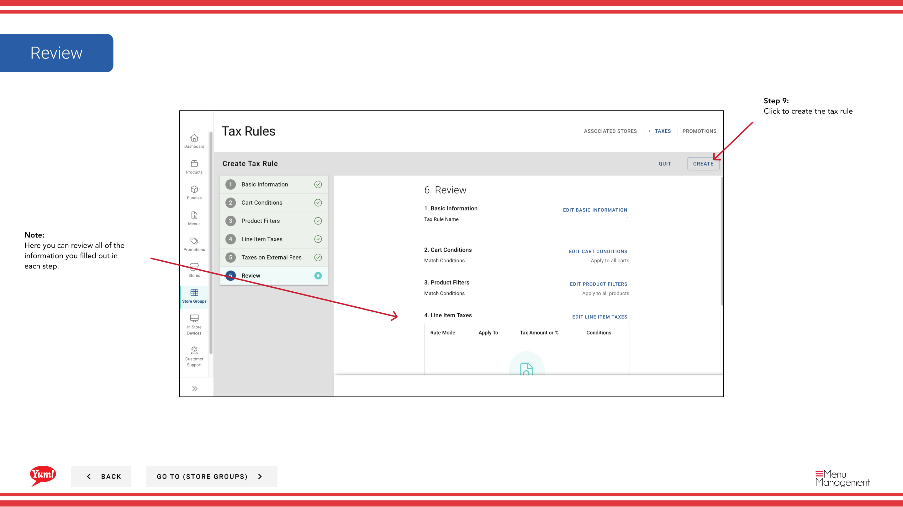

# Create Tax Rules

## What this guide covers

Defines individual tax rules within a store group, specifying the tax rates and conditions applied to items sold at member stores.

## Steps

**Step 1:** Start by going to the Store Groups screen by clicking here.
**Step 2:** Once you find the store group you are looking for, click on the stacked dots to open the option window.

**Step 3:** Click taxes

**Step 4:** Click this button to create a new tax rule

**Step 5:** Type in the tax names and when the dates the taxes are effective from. You can also create or add a tax rule group that already exists.

**Step 5:** Make more selections or remove stores that already selected

**Step 6:** Select a matching condition in this dropdown. (For cart conditions)

**Step 7:** Select a matching condition in this dropdown. (For product filters)

**Step 8:** Press this button to add tax. This will open up the field below and allows you input the rate mode, what is apply to, or tax amount %

**Step 9:** Fill out taxes on external fees

**Step 9:** Click to create the tax rule

## Notes

:::note
You can click on each step to navigate throughout each flow
:::

:::note
This will be automatically selected to see other stores than you selected uncheck this
:::

:::note
Here you can review all of the information you filled out in each step.
:::

:::note
You can edit, copy, and delete tax rules.
:::

## Additional information

- Store Groups - Create Tax Rules
- You can search by store group name and store group tags and see whether or not a store group has a tax association
- Taxes on External Fees
- Tax Screen (Tax Rules)

---

*Part of the [Admin Portal Guide](/docs/admin-portal-guide) · Section: Store Groups*