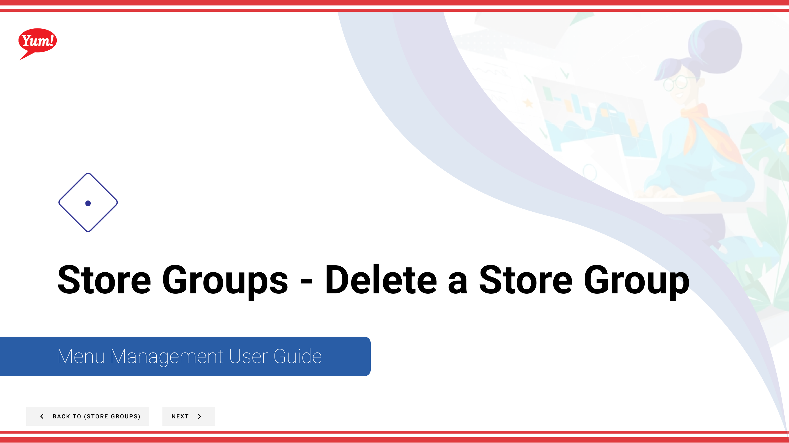

# Delete a Store Group

## What this guide covers

Permanently removes a store group from the system.

## Steps

**Step 1:** Start by going to the Store Groups screen by clicking here.

**Step 2:** Once you find the store group you are looking for, click on the stacked dots to open the option window.

**Step 3:** Click delete

**Step 4:** Click to delete

## Notes

:::note
Cancel at anytime if necessary
:::

:::note
All tax rules and promotions tied to stores in this store group will be removed if deleted
:::

## Additional information

- Menu Management User Guide
- Store Groups - Delete a Store Group
- You can search by store group name and store group tags and see whether or not a store group has a tax association

---

*Part of the [Admin Portal Guide](/docs/admin-portal-guide) · Section: Store Groups*