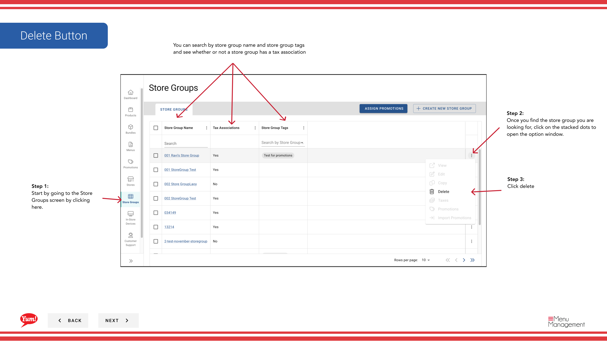
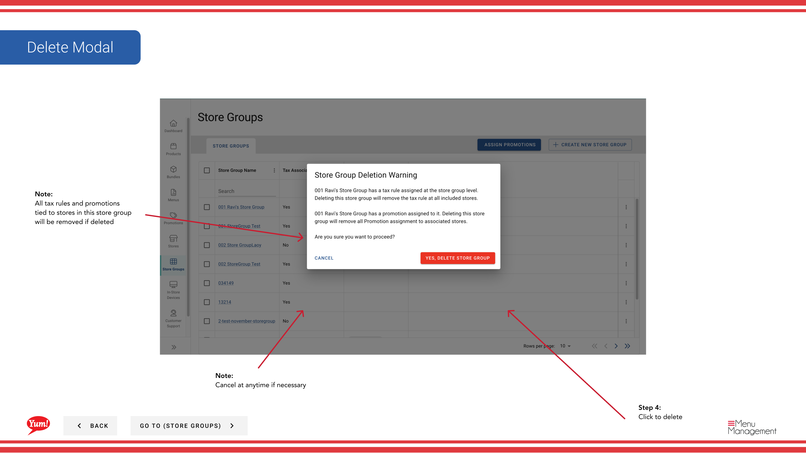

# Delete a Store Group

## What this guide covers

Permanently removes a store group from the system, along with all associated promotions and tax rules.

## Steps

**Step 1:** Navigate to the **Store Groups** section using the left-hand navigation menu.

**Step 2:** Find the store group you want to delete by browsing the table or using the search bar. Click the **action menu button** (three dots) next to the store group name.

**Step 3:** Click **Delete**.

**Step 4:** A confirmation dialog will appear. Review the warning message and click the **Delete Store Group** button to confirm permanent deletion.

:::caution
**This action is permanent and cannot be undone.** Deleting a store group will:
- Remove the store group from the system
- Unlink all promotions assigned to this store group
- Unlink all tax rules associated with this store group
- The member stores themselves are not deleted, only their grouping and assignments

:::tip
If you need to keep the store group configuration for future use, consider **copying** it before deletion.
:::

## Related guides

- [Create a Store Group](/docs/admin-portal-guide/store-groups/create-a-store-group/)
- [Copy a Store Group](/docs/admin-portal-guide/store-groups/copy-a-store-group/)
- [Edit a Store Group](/docs/admin-portal-guide/store-groups/edit-a-store-group/)

---

*Part of the [Admin Portal Guide](/docs/admin-portal-guide) · Section: Store Groups*