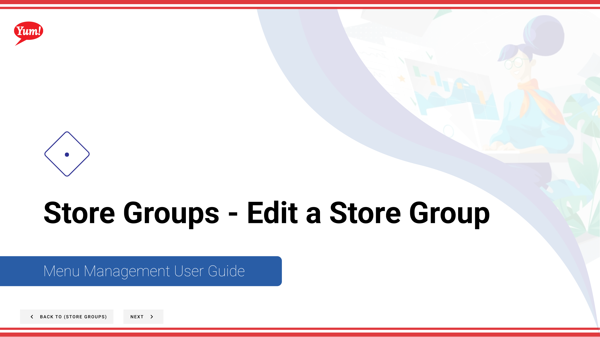
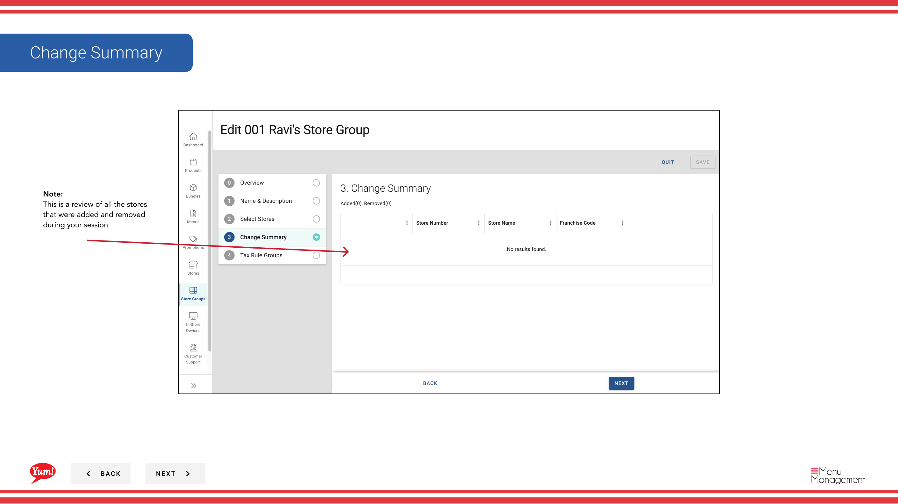

# Edit a Store Group

## What this guide covers

Updates a store group's details, name, or store membership.

## Steps

**Step 1:** Start by going to the Store Groups screen by clicking here.

**Step 2:** Once you find the store group you are looking for, click on the stacked dots to open the option window.

**Step 3:** Click on edit

**Step 4:** Here’s an overview of all the contents of the store groups. You can edit

**Step 5:** Type in the store group name for the store you want to create and enter any store group tags if needed.

**Step 6:** Toggle this switch to select a store

## Notes

:::note
You can click on each step to navigate throughout each flow
:::

:::note
This table allows you to filter by store number, store name, and franchise code to find specific stores.
:::

:::note
You can filter by stores and by store groups
:::

:::note
This is a review of all the stores that were added and removed during your session
:::

:::note
Here you can view all of the tax rules tied to the store group to edit the tax rules (add or remove rules) you will need to click the taxes button in the more kebab menu associated with the store group
:::

## Additional information

- Menu Management User Guide
- Store Groups - Edit a Store Group
- You can search by store group name and store group tags and see whether or not a store group has a tax association

---

*Part of the [Admin Portal Guide](/docs/admin-portal-guide) · Section: Store Groups*