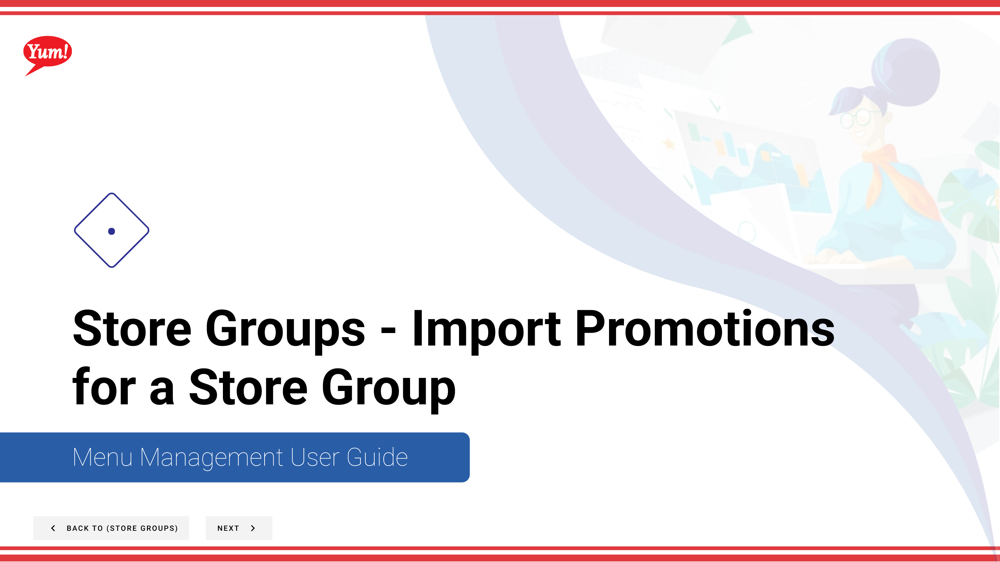

# Import Promotions for a Store Group

## What this guide covers

Bulk-imports promotion assignments into a store group for large-scale campaign setup.

## Steps

**Step 1:** Start by going to the Store Groups screen by clicking here.

**Step 2:** Once you find the store group you are looking for, click on the stacked dots to open the option window.

**Step 3:** Click Import Promotions

**Step 4:** Select the store group you want to import promotions from.

**Step 5:** Click save

## Notes

:::note
Keep this switch on if you want to import all promotions from a store group. Otherwise turn this switch off so you can select what specific promotions you want to add to this store group.
:::

:::note
If you don’t want to import all promotions from a store group. Turn this switch off so you can select what specific promotions you want to add to this store group.
:::

## Additional information

- Menu Management User Guide
- Store Groups - Import Promotions for a Store Group
- Import Promotions Button
- You can search by store group name and store group tags and see whether or not a store group has a tax association

---

*Part of the [Admin Portal Guide](/docs/admin-portal-guide) · Section: Store Groups*