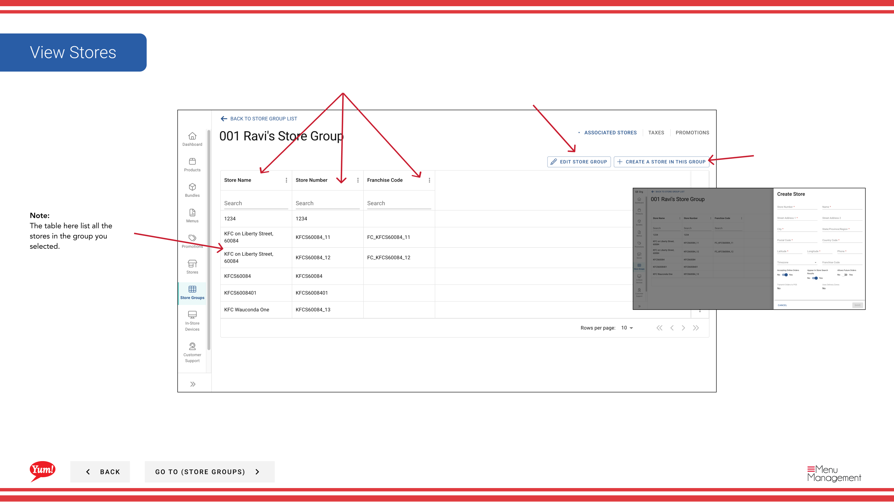

# View Stores in a Store Group

## What this guide covers

Lists all stores currently belonging to a store group for visibility and verification purposes.

## Steps

**Step 1:** Navigate to the **Store Groups** section using the left-hand navigation menu.

**Step 2:** Browse the Store Groups table to find the group you want to view, or use the search bar to locate it. Click on the **store group name** to view its details.

**Step 3:** A detailed view will open showing:

- **Store Group Name** — The name of the selected group
- **Store Group Tags** — Any tags assigned to this group
- **Stores Table** — A complete list of all stores in this group

The table displays:
- **Store Number** — Unique identifier for each store
- **Store Name** — Name of the store location
- **Franchise Code** — Franchise identifier if applicable
- **Tax Rules** — Whether this group has associated tax rules

:::note
The stores table lists all stores currently belonging to this store group. To modify store membership, see [Edit a Store Group](/docs/admin-portal-guide/store-groups/edit-a-store-group/).
:::

## Related guides

- [Edit a Store Group](/docs/admin-portal-guide/store-groups/edit-a-store-group/)
- [Create a Store Group](/docs/admin-portal-guide/store-groups/create-a-store-group/)
- [Assign Promotions](/docs/admin-portal-guide/store-groups/assign-promotions/)

---

*Part of the [Admin Portal Guide](/docs/admin-portal-guide) · Section: Store Groups*