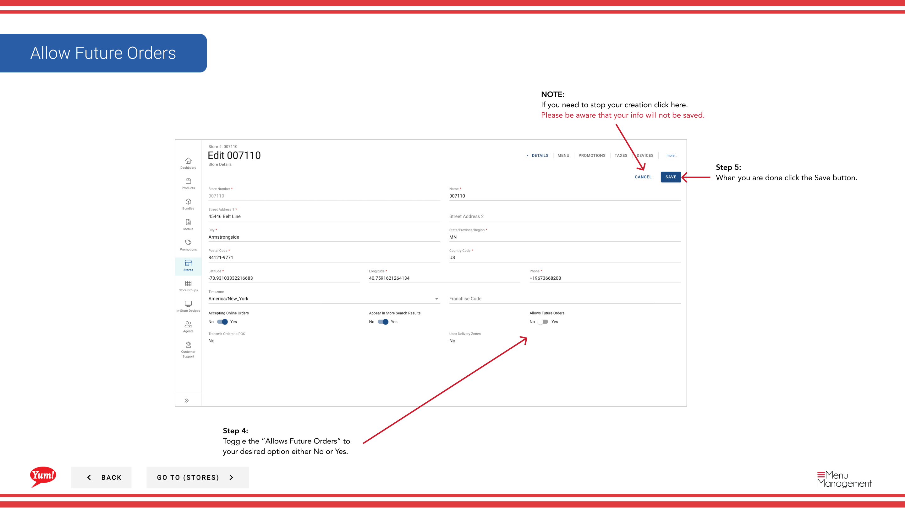

# Allow Future Orders (Turn On or Off)

## What this guide covers

Enables or disables a store’s ability to accept orders placed in advance, relevant for pre-order or scheduled delivery capabilities.

## Steps

**Step 1:** Navigate to the **Stores** section using the left-hand navigation menu.

**Step 2:** Search for the store by **Name**, **Store Number**, or **Franchise Code** using the search box.

**Step 3:** Once you find the store, click the **store name** (or any blue hyperlink) to view the store details, or click the **three-dot menu** (•••) icon and select **Edit**.

**Step 4:** Locate the **Allows Future Orders** toggle and set it to your desired state:
- **Yes**: Customers can place orders in advance for scheduled delivery or pickup
- **No**: Customers can only place orders for immediate fulfillment

**Step 5:** Click the **Save** button to apply the change.

:::note
**Future Orders Requirement:** This setting requires the store to have a supported ordering channel configured. Confirm with your regional manager if your store supports this capability.
:::

:::caution
Clicking **Cancel** at any time discards your change.
:::

## Related guides

- [Edit Store Details](/docs/admin-portal-guide/stores/edit-store-details/) — Update other store information

---

*Part of the [Admin Portal Guide](/docs/admin-portal-guide) · Section: Stores*