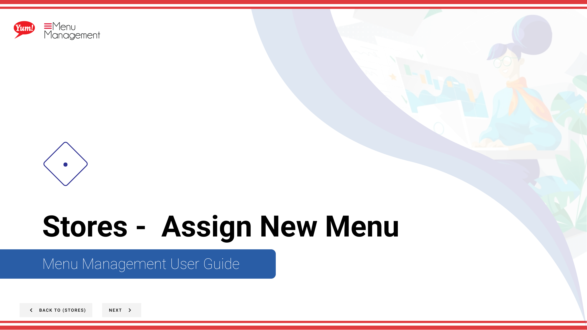

# Assign New Menu

## What this guide covers

Links a new or replacement menu to a store's channel, updating what customers see when ordering from that location.

## Steps

**Step 1:** Start by going to the Stores screen by clicking here.

**Step 2:** You can search stores by entering the Name, Number, or Franchise Code.

**Step 3:** Once you find the store you are looking for, click on the stacked dots to open the option window.

**Step 4:** Click on Menus.

**Step 6:** Click this more button and then hit “Assign New Menu”

**Step 7:** Select a menuu from this list to assign a new menu to a menu channel

**Step 8:** Select this to assign menu

## Notes

:::note
There are other options in the window  but for this step we are just looking at Menus. Others are discussed else where. Please go to the Table of Contents to find where.
:::

## Additional information

- Stores -  Assign New Menu

---

*Part of the [Admin Portal Guide](/docs/admin-portal-guide) · Section: Stores*