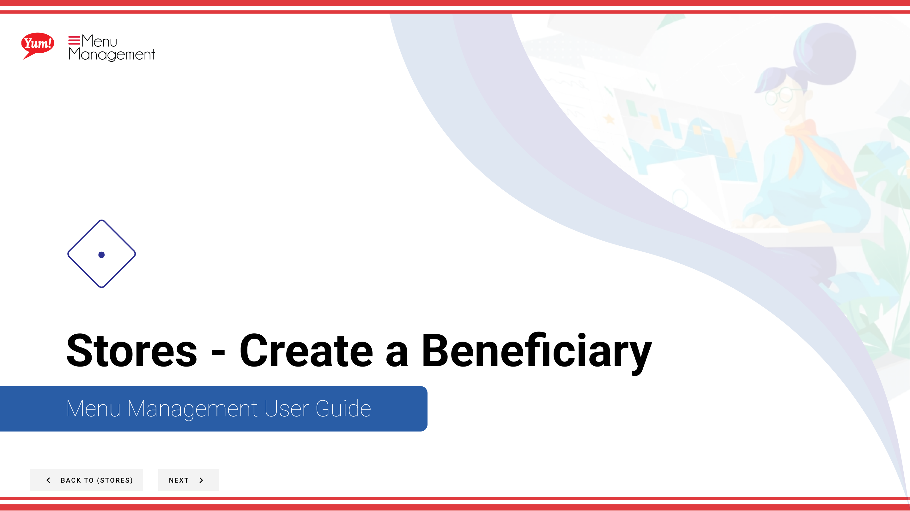

# Create a Beneficiary

## What this guide covers

Sets up a charitable beneficiary linked to specific stores, enabling donation round-up or charity campaign functionality at those locations.

## Steps

**Step 1:** Start by going to the Stores screen by clicking here.

**Step 2:** Click on the Beneficiaries tab.

**Step 3:** Click the “+ Create New Beneficiary” button

**Step 4:** Fill in each “*”required field and other valuable information.

**Step 5:** To turn on the new beneficiary click the toggle to set it to Yes.

**Step 6:** Select/find from the dropdown the stores you would like to be a beneficiary.

**Step 7:** You can use the filter options to see if a store is a beneficiary when the list is long.

**Step 8:** When you are done the Create Beneficiary button will become active to click and save your new beneficiary.

## Notes

:::note
If you need to see if a beneficiary has already been created you can search for it by name here.
:::

:::note
The “Accepting Donations” column may show a green circle with a check mark to indicate that the Beneficiaries is turned on.
:::

:::note
If you need to stop your creation click here. Please be aware that your info will not be saved.
:::

## Additional information

- Stores - Create a Beneficiary

---

*Part of the [Admin Portal Guide](/docs/admin-portal-guide) · Section: Stores*