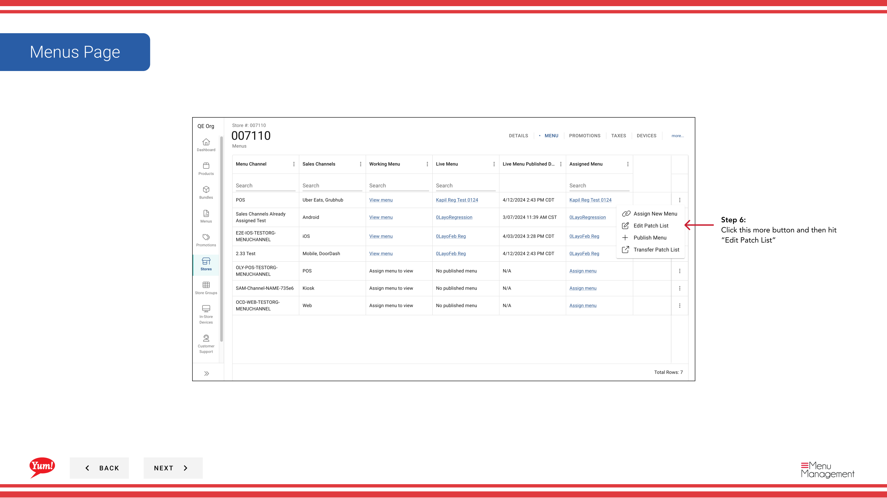

# Edit Patch List

## What this guide covers

Manages the ordered list of patches applied to a store's menu, allowing operators to add, reorder, or remove patches that layer overrides on the base menu.

## Steps

**Step 1:** Start by going to the Stores screen by clicking here.

**Step 2:** You can search stores by entering the Name, Number, or Franchise Code.
**Step 3:** Once you find the store you are looking for, click on the stacked dots to open the option window.

**Step 4:** Click on Menus.

**Step 6:** Click this more button and then hit “Edit Patch List”

**Step 7:** Select patch by name

**Step 8:** Click “save” to save patch edits.

**Step 8:** Order the patches

## Notes

:::note
There are other options in the window  but for this step we are just looking at Menus. Others are discussed else where. Please go to the Table of Contents to find where.
:::

## Additional information

- Stores -  Edit Patch List

---

*Part of the [Admin Portal Guide](/docs/admin-portal-guide) · Section: Stores*