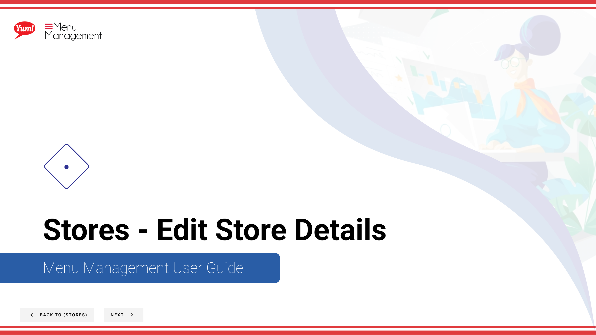

# Edit Store Details

## What this guide covers

Updates an existing store's information such as name, settings, or operational fields.

## Steps

**Step 1:** Start by going to the Stores screen by clicking here.

**Step 2:** Once you find the store you are looking for, click on the stacked dots to open the option window.

**Step 3:** Click on Edit.

**Step 4:** Edit each area as needed making sure to fill in each “*”required field.

**Step 5:** When you are done the Save button will become active to click and save your new store.

## Notes

:::note
You can search stores by entering the Name, Number, or Franchise Code.
:::

:::note
There are other options in the window  but for this step we are just looking at Edit. Others are discussed else where. Please go to the Table of Contents to find where.
:::

:::note
If you need to stop your creation click here. Please be aware that your info will not be saved.
:::

## Additional information

- Stores - Edit Store Details

---

*Part of the [Admin Portal Guide](/docs/admin-portal-guide) · Section: Stores*