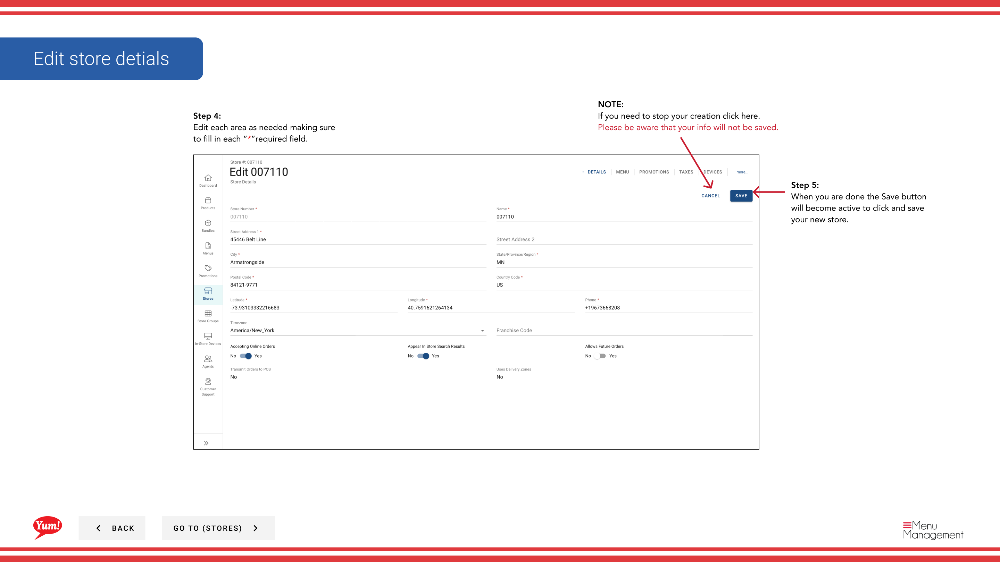

# Edit Store Details

## What this guide covers

Updates an existing store's information such as name, settings, or operational fields.

## Steps

**Step 1:** Navigate to the **Stores** section using the left-hand navigation menu.

**Step 2:** Search for the store by **Name**, **Store Number**, or **Franchise Code** using the search box.

**Step 3:** Once you find the store, click the **three-dot menu** (•••) icon on the store's row to open the options menu.

**Step 4:** Click **Edit** from the dropdown menu.

**Step 5:** Update the store fields as needed. Refer to the field descriptions below. All fields marked with * are required.

| Field | What to enter | Notes |
|-------|--------------|-------|
| **Store Name** * | Full display name of the store | e.g., “KFC George Street Sydney” |
| **Store Number** * | Unique numeric identifier assigned by market operations | Must match the POS-assigned store number |
| **Franchise Code** * | Alphanumeric code identifying the franchisee | Provided by your regional manager |
| **Time Zone** | The store's local time zone | Required for item snooze and future order accuracy |
| **Accepting Online Orders** | Toggle: Yes or No | Set to No during closures or operational issues |
| **Appear in Store Search Results** | Toggle: Yes or No | Set to No to hide a location without deleting it |
| **Allows Future Orders** | Toggle: Yes or No | Enables customers to place advance orders; requires a supported channel |

**Step 6:** Once all changes are complete, the **Save** button becomes active. Click **Save** to update the store.

:::caution
Clicking **Cancel** at any time discards all unsaved changes.
:::

## Related guides

- [Create a Store](/docs/admin-portal-guide/stores/create-a-store/) — Register a new store
- [Accept Online Orders (Turn On or Off)](/docs/admin-portal-guide/stores/2a-accept-online-orders-turn-on-or-off/) — Toggle order acceptance separately

---

*Part of the [Admin Portal Guide](/docs/admin-portal-guide) · Section: Stores*