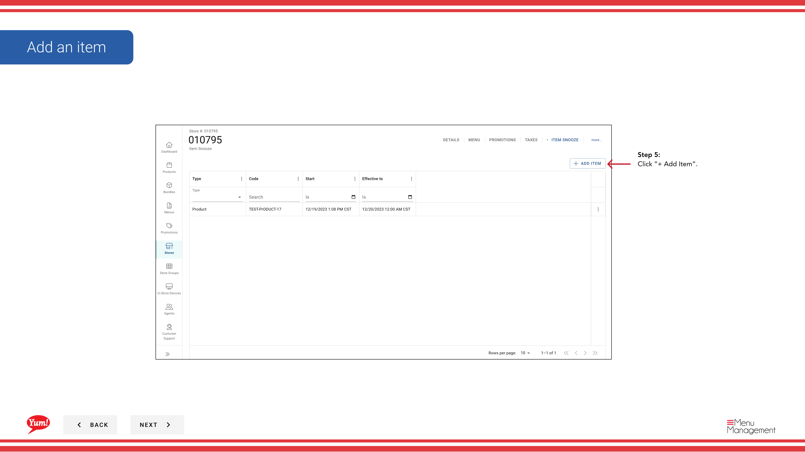
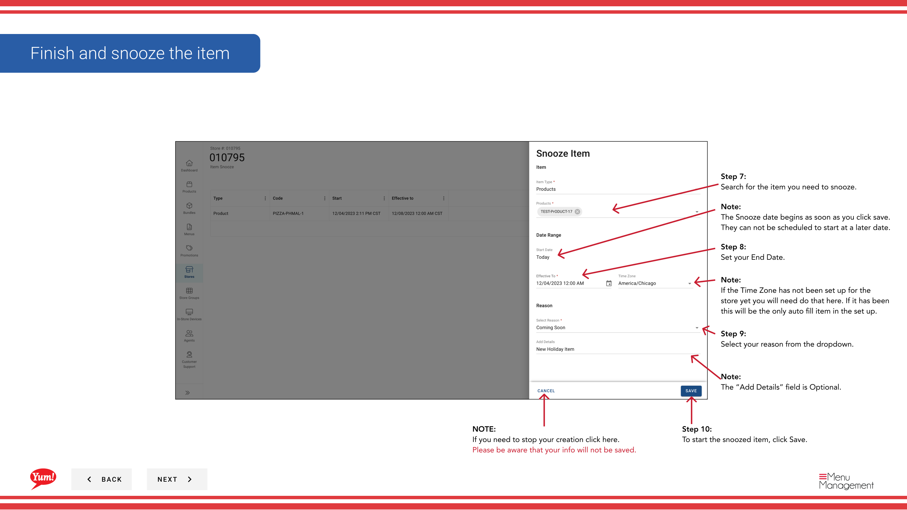

# Item Snooze

## What this guide covers

Temporarily removes a specific item from a store's menu for a defined period and reason (e.g. stock outage), allowing it to automatically return when the snooze period ends.

## Steps

**Step 1:** Start by going to the Stores screen by clicking here.
**Step 2:** You can search stores by entering the Name, Number, or Franchise Code.

**Step 3a:** Once you find the store you are looking for, click on the stacked dots to open the option window.

**Step 3b:** If you are in the Store Edit screen click on “more...” to reveal the dropdown.

**Step 4a:** Click on Item Snooze.

**Step 4b:** Select Item Snooze

**Step 5:** Click “+ Add Item”.

**Step 6:** Choose the Item Type you would like to snooze from the dropdown.

**Step 7:** Search for the item you need to snooze.

**Step 8:** Set your End Date.

**Step 9:** Select your reason from the dropdown.

**Step 10:** To start the snoozed item, click Save.

## Notes

:::note
There are other options in the window  but for this step we are just looking at Item Snooze. Others are discussed else where. Please go to the Table of Contents to find where.
:::

:::note
There are two paths to the Item Snooze  section. It depends on where you are in the flow for which path you will take, Step 3&4a or 3&4b.
:::

:::note
The Snooze date begins as soon as you click save. They can not be scheduled to start at a later date.
:::

:::note
If the Time Zone has not been set up for the store yet you will need do that here. If it has been this will be the only auto fill item in the set up.
:::

:::note
The “Add Details” field is Optional.
:::

:::note
If you need to stop your creation click here. Please be aware that your info will not be saved.
:::

## Additional information

- Edit Store Screen (Skip Page If You’re Not On This Screen)
- Finish and snooze the item
- View all details of the Snoozed Item or delete it here.
- You can Snooze more items at this store, here.

---

*Part of the [Admin Portal Guide](/docs/admin-portal-guide) · Section: Stores*