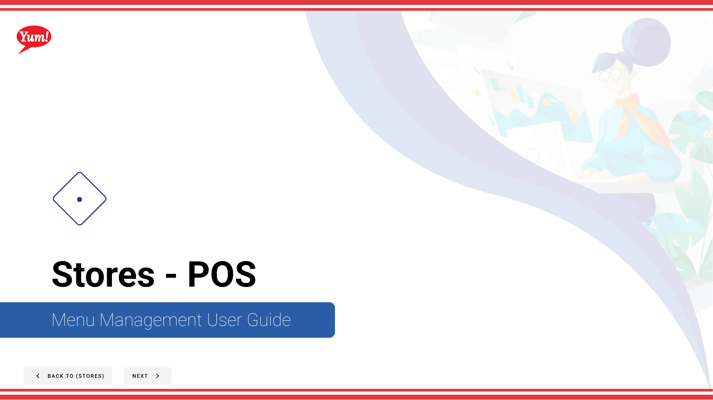

# POS

## What this guide covers

Shows a store's connected point-of-sale devices, their status, and allows operators to update device settings or generate one-time passwords for device authentication.

## Steps

**Step 1:** Start by going to the Stores screen by clicking here.

**Step 2:** You can search stores by entering the Name, Number, or Franchise Code.

**Step 3:** Once you find the store you are looking for, click on the stacked dots to open the option window.

**Step 4:** Click on POS.

## Notes

:::note
There are other options in the window  but for this step we are just looking at POS. Others are discussed else where. Please go to the Table of Contents to find where.
:::

:::note
Within the store pos table you can see the device name, station type, device status, menu date published, last device check in, and do two actions (view and deactivate)
:::

## Additional information

- Update Store Device Settings Clicking this button will open up this drawer and allow you to update the device settings for the store.
- Generate One-Time Password Click this button and it will open this modal that provides you with a one-time password for the POS Device.

---

*Part of the [Admin Portal Guide](/docs/admin-portal-guide) · Section: Stores*