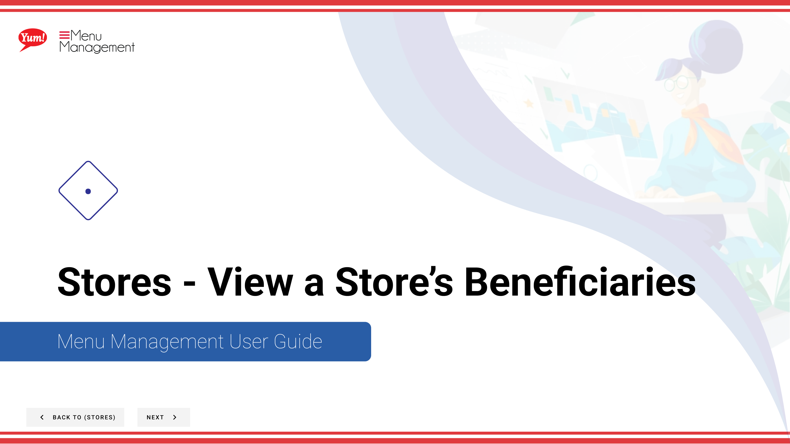
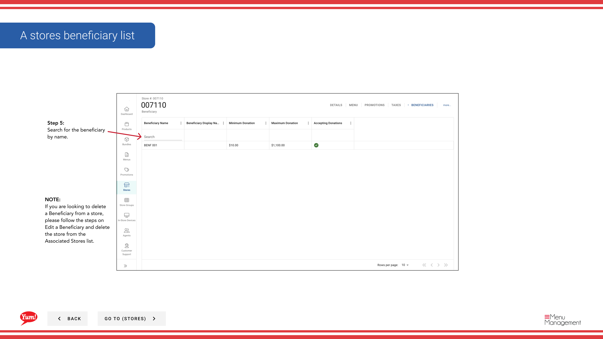

# View a Store's Beneficiaries

## What this guide covers

Lists the beneficiaries linked to a specific store for visibility and management.

## Steps

**Step 1:** Start by going to the Stores screen by clicking here.

**Step 2:** You can search stores by entering the Name, Number, or Franchise Code.

**Step 3:** Once you find the store you are looking for, click on the stacked dots to open the option window.

**Step 4:** Click on Beneficiaries.

**Step 5:** Search for the beneficiary by name.

## Notes

:::note
There are other options in the window  but for this step we are just looking at Beneficiaries. Others are discussed else where. Please go to the Table of Contents to find where.
:::

:::note
If you are looking to delete a Beneficiary from a store, please follow the steps on Edit a Beneficiary and delete the store from the Associated Stores list.
:::

## Additional information

- Stores - View a Store’s Beneficiaries
- A stores beneficiary list

---

*Part of the [Admin Portal Guide](/docs/admin-portal-guide) · Section: Stores*