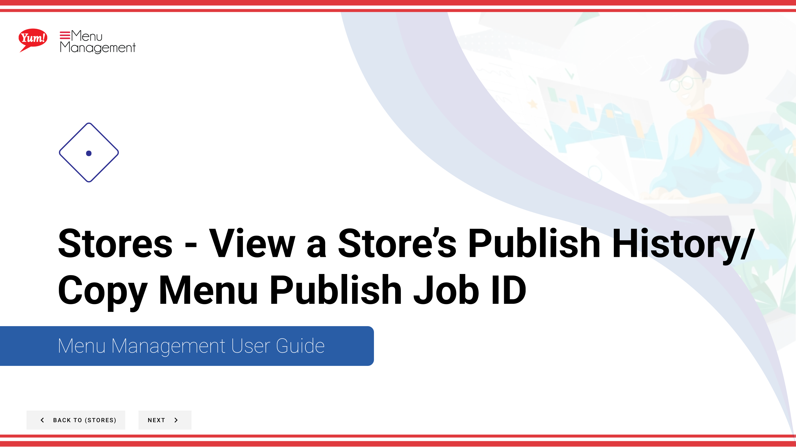

# View a Store’s Publish History/ Copy Menu Publish Job ID

## Steps

**Step 1:** Start by going to the Stores screen by clicking here.

**Step 2:** Click on the Publish History tab.

**Step 3:** Click on any row to open for more details.

## Notes

:::note
When contacting Support for help, click here to copy the Menu Publish Job ID to attach to your email.
:::

## Additional information

- Stores - View a Store’s Publish History/ Copy Menu Publish Job ID
- View publish history of a store

---

*Part of the [Admin Portal Guide](/docs/admin-portal-guide) · Section: Stores*