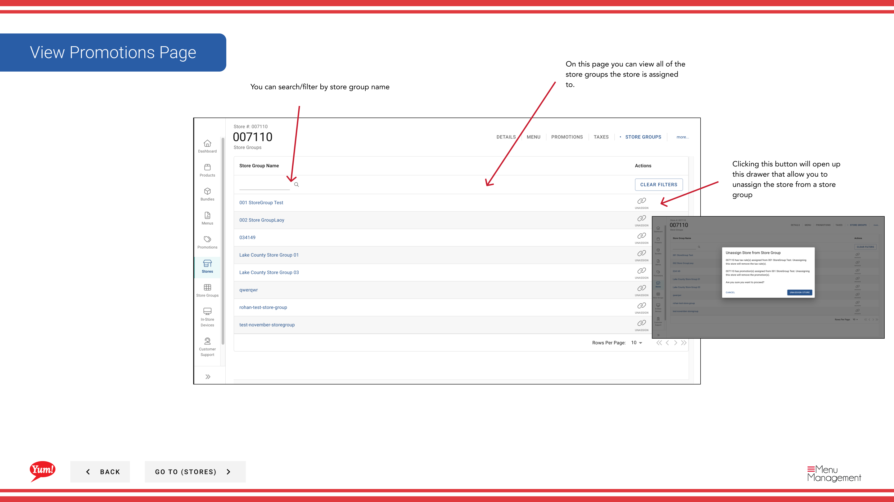

# View/Unassign a Store's Store Groups

## What this guide covers

Displays the store groups a store belongs to and allows operators to unassign the store from a group when needed.

## Steps

**Step 1:** Navigate to the **Stores** section using the left-hand navigation menu.

**Step 2:** Search for the store by **Name**, **Store Number**, or **Franchise Code** using the search box.

**Step 3:** Once you find the store, click the **three-dot menu** (•••) icon to open the options menu.

**Step 4:** Click **Store Groups** from the dropdown menu. This displays all store groups the selected store is assigned to.

**Step 5:** Review the store groups table, which shows:
- **Store Group Name** — Name of the store group this store belongs to
- **Status** — Assignment status (Active, etc.)

**Step 6:** Use the search/filter box to narrow the list by **store group name** if the list is long.

### To Unassign a Store from a Group:

**Step 7:** Click the **three-dot menu** (•••) icon on the store group row you want to remove.

**Step 8:** Click **Unassign** from the menu. This removes the store from the selected store group.

**Step 9:** Confirm the unassignment in the modal that appears by clicking **Unassign** again.

:::caution
Unassigning a store from a group may affect tax rules, promotions, and menu configurations tied to that group. Verify with your regional manager before unassigning.
:::

:::tip
Store groups are used to organize stores by region, franchise, or operational category. Check which store groups should be associated with a store before making changes.
:::

## Related guides

- [View Taxes](/docs/admin-portal-guide/stores/view-taxes/) — See tax rules by store group

---

*Part of the [Admin Portal Guide](/docs/admin-portal-guide) · Section: Stores*