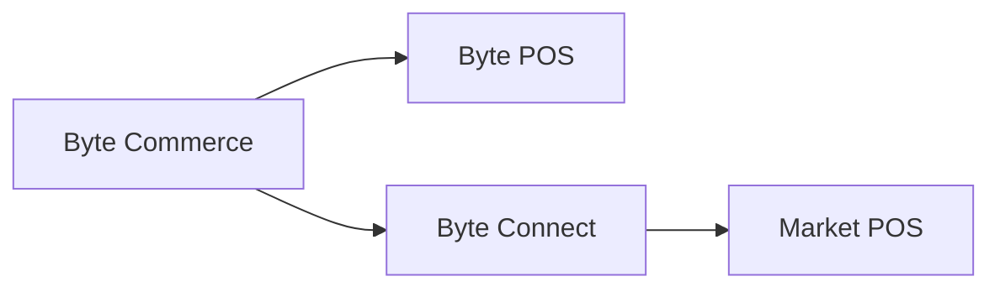

# Byte Connect

> Byte Connect is the bridge between Byte Commerce and a market's POS when that market is not using Byte POS.

---

## The Core Rule

If a market is **not** using **Byte POS**, then **Byte Connect must be onboarded as part of Byte Commerce onboarding**.

Byte Commerce is wired to talk directly to **Byte POS**. For non-Byte POS markets, Byte Connect sits in the middle and handles the integration path to the market POS.

---

## What Byte Connect Does

Byte Connect acts as the integration bridge that allows Byte Commerce orders and order updates to flow to and from a non-Byte POS environment.

That means the operating mental model is:

- **Byte Commerce -> Byte POS** when the market uses Byte POS
- **Byte Commerce -> Byte Connect -> POS** when the market does not use Byte POS

The most important thing to avoid is assuming Byte Commerce can directly talk to any market POS by default. It cannot. If Byte POS is not present, Byte Connect is the required bridge.

---

## What This Means for Onboarding

For non-Byte POS markets, Byte Connect is not an optional add-on. It is part of the Byte Commerce onboarding bundle.

Teams planning market setup, rollout scope, timelines, or integration responsibilities should treat Byte Connect as a standard dependency whenever the market POS is not Byte POS.

---

## When To Reference This

Use this page whenever teams need to explain:

- why Byte Commerce does not directly integrate with every POS
- why a non-Byte POS market needs Byte Connect
- how Byte Commerce reaches the store system in a non-Byte POS market

---

:::tip Related
- [Capability Boundaries](/docs/byte-capabilities/enablement/capability-boundaries)
- [Commerce Backend Reference](/docs/byte-capabilities/reference/commerce-backend)
- [Platform Mental Model](/docs/byte-capabilities/mental-model)
:::
