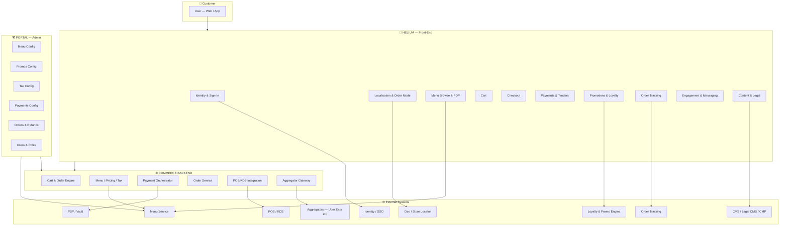

# 🧠 Platform Mental Model

Understanding the platform starts with understanding the three-layer hierarchy — what each layer is responsible for, and how they relate to each other.

---

## The Three Layers

**KFC Atlas** has three major layers:

- **Helium** — The customer-facing front-end (web + app). What customers see and interact with. Helium renders everything but owns very little — pricing, eligibility, and state all come from the backend.
- **Commerce Backend (BCOM)** — The engine behind every order. Handles cart state, pricing, tax calculation, payment processing, and POS injection. Invisible to customers, critical to everything.
- **Portal** — The admin control plane. Market and ops teams use this to configure stores, menus, promotions, taxes, payments, users, and content.

These three layers connect to a set of **external services**: Menu, Identity/SSO, PSP (payments), Loyalty/Promos Engine, Order Tracking, CMS, and Analytics.

---

## Platform Hierarchy

```
ATLAS PLATFORM
├── HELIUM (Customer Front-End)
│   ├── Identity & Sign-In
│   │   ├── Email + OTP sign-in
│   │   ├── Google / Apple OAuth
│   │   ├── Account management & profile
│   │   └── Privacy, consent & account deletion
│   ├── Localisation & Order Mode
│   │   ├── Market / locale detection
│   │   ├── Collection mode selection
│   │   ├── Delivery mode + coverage check
│   │   └── Store locator (Find a KFC)
│   ├── Menu Browse & PDP
│   │   ├── Product Listing Page (PLP)
│   │   ├── Product Detail Page (PDP)
│   │   ├── Item modifiers & options
│   │   └── Nutrition & allergens guide
│   ├── Cart
│   │   ├── Add / update / remove items
│   │   ├── Apply / remove rewards
│   │   └── Apply promo codes
│   ├── Checkout
│   │   ├── Guest checkout
│   │   ├── Registered checkout
│   │   ├── Delivery variant
│   │   └── Collection variant
│   ├── Payments & Tenders
│   │   ├── Card payment (tokenised)
│   │   ├── Voucher-only payment
│   │   ├── Split tender (card + voucher)
│   │   ├── Gift card resend
│   │   └── Saved card management
│   ├── Promotions & Loyalty
│   │   ├── Offers feed (localised)
│   │   ├── Rewards catalogue
│   │   ├── Challenges
│   │   ├── Loyalty onboarding & points
│   │   └── Communication preferences
│   ├── Donations & Tips
│   │   ├── Add-Hope donations
│   │   └── Delivery driver tips
│   ├── Order Tracking & History
│   │   ├── Real-time delivery tracking
│   │   ├── Order history & receipts
│   │   ├── Order Again
│   │   └── Favourite orders
│   ├── Content & Legal
│   │   ├── CMS pages (About, FAQ, Careers)
│   │   ├── Terms & Conditions
│   │   ├── Privacy Policy
│   │   └── Cookie settings
│   └── Engagement & Messaging
│       ├── In-app inbox
│       └── Push notification preferences
│
├── COMMERCE BACKEND (BCOM)
│   ├── Cart & Order Lifecycle
│   ├── Menu Consumption, Pricing & Tax
│   ├── Payments & Refunds
│   ├── Customer Accounts & Auth
│   ├── Preferences & Loyalty Linking
│   ├── POS / KDS Integration
│   ├── Aggregator Integration (Byte Connect)
│   ├── Data Migration
│   └── Observability
│
└── PORTAL (Admin Control Plane)
    ├── Users & Roles (RBAC + Scope Guard)
    ├── Stores & Store Groups
    ├── Menu Assignment, Patching & Overrides
    ├── Promotions Management
    ├── Tax Configuration
    ├── Payments Configuration
    ├── Orders & Refunds (Ops)
    ├── Localisation & Content Management
    ├── Reporting & Exports
    ├── Webhooks & Integrations
    ├── Settings, Feature Flags & Maintenance
    ├── Audit & Observability
    └── Shared Catalogues
```

---

## System Architecture Diagram

This diagram shows how the three platform layers connect to each other and to external services.



---

:::tip Read next
See [Platform Layers](/docs/byte-capabilities/platform-layers) for a plain-English breakdown of what each layer does and what markets can configure.
:::
